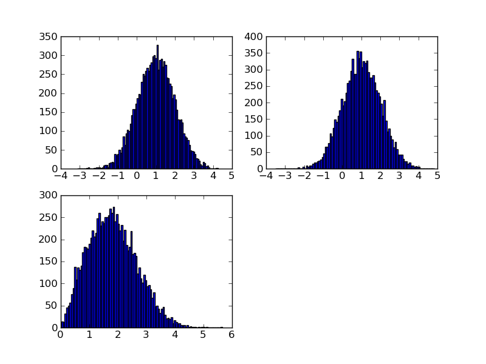

# Introduction

This website is hosted using the [GitHub Pages system](https://pages.github.com) with the [Cayman](https://github.com/pages-themes/cayman) theme.

It is written using the [Markdown](https://guides.github.com/features/mastering-markdown/) which is a simple way of writing structured documents without much of the complexity of HTML.

I can use it to make quite complicated sites.  For example https://www.robotictelescope.org/telescope/

I can use it to

* Write unordered Lists
* For Example

or 

1.  Ordered lists
1.  with numbers
    1.  and another

Or I can format some example code:


```c
    int main() 
      {
      printf("Hello World");
      }
```

[Here is a link to a second page](second.md)

Here is an image



# LinkedIn

https://www.linkedin.com/feed/

# Using GitHub

These links give a basic introduction to using [GitHub](https://guides.github.com/activities/hello-world/) and the [GitHub Work Flow](https://guides.github.com/introduction/flow/).

Usually, instead of editing on the GitHub website,  you would pull the repo to your desktop pc, edit/test your changes, then commit 
them back to a branch.  You can either do this with the [command line git tools](https://docs.gitlab.com/ce/gitlab-basics/start-using-git.html) or various development Environmenmts (e.g. RStudio) can have github support built in.  They are ususally based on top of [GitForWindows](https://gitforwindows.org).


# Tools for writing Project Reports

For you project report you have two obvious choices in the tools you choose.

1.  Microsoft Word (+ Endnote reference manager).  Both of these tools are on the LJMU App Player.  I am not an expert on either of them!
1.  LaTeX (+ bibTeX reference manager).  [LaTeX](https://www.latex-tutorial.com/tutorials/) is a document preparation system that is well suited to  scientific/mathematical documents.  Rather than installing it yourself, the online [Overleaf](https://www.overleaf.com) system is easy to use and provides the ability to collaboratively edit and then download a resulting PDF.

Even if you want to use Word to write the document, [latex2png](http://latex2png.com) is a very nice way of generating PNG equations to paste into your word document.

Add some more text here.

# Tools for Literature Searches and Access

*  [Google Scholar](https://scholar.google.co.uk) - general, free
*  [Web Of Science](https://webofknowledge.com/) - general, LJMU licencse
*  [Scopus](https://www.scopus.com/) - general, LJMU license
*  [NASA ADS](https://ui.adsabs.harvard.edu/) - astronomy/astrophysics
*  [PubMed](https://www.ncbi.nlm.nih.gov/pubmed/) - life sciences
*  [The arXiv](https://arxiv.org) - preprints.  Use varies by discipline


